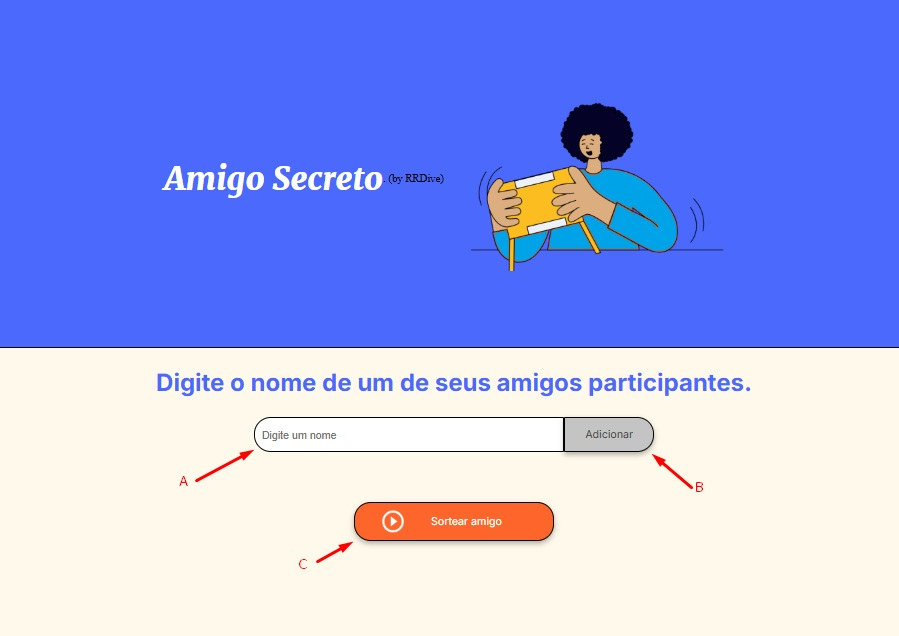

# Índice 

* [Título e Imagem de capa](#Título-e-Imagem-de-capa)
* [Descrição do Projeto](#descrição-do-projeto)
* [Status do Projeto](#status-do-Projeto)
* [Funcionalidades e Demonstração da Aplicação](#funcionalidades-e-demonstração-da-aplicação)
* [Acesso ao Projeto](#acesso-ao-projeto)
* [Tecnologias utilizadas](#tecnologias-utilizadas)
* [Pessoas Contribuidoras](#pessoas-contribuidoras)
* [Pessoas Desenvolvedoras do Projeto](#pessoas-desenvolvedoras)
* [Licença](#licença)
* [Conclusão](#conclusão)

License: [Alura - Projeto ONE]

#Título-e-Imagem-de-capa

#descrição-do-projeto

Projeto criado em Jan/2025, como fruto de aprendizado em programação JavaScript disponibilizado pelo Projeto ONE (Oracle + Alura).

Esta ferramenta demonstra lógica de programação com a utilização de função de números aleatórios, cadastramento de nomes em array e "sorteio" de um dos nomes cadastrados

O objetivo desta ferramenta consiste no "Sorteio Aleatório" de um dos nomes previamente cadastrados, elegendo-o como seu Amigo Secreto.

#status-do-Projeto

Este projeto encontra-se CONCLUÍDO, tomando como base as orientações fornecidas através dos cards via Trello.

Contudo, algumas melhorias podem ser aplicadas, de maneira a gerar uma lista entre os amigos cadastrados (e não apenas 1 nome), permitindo assim que seja utilizada em vários eventos/momentos.

#funcionalidades-e-demonstração-da-aplicação

Esta ferramenta possui uma única tela, onde destacamos:

A: Campo para ser informado/digitado cada um dos nomes das pessoas indicadas.

B: Botão destinado à verificação e inserção do nome informado/digitado, na lista, caso o mesmo não tenha sido informado anteriormente.

C: Botão destinado à realização (de maneira aleatória) do "sorteio" do nome indicado para ser seu AMIGO SECRETO (se pressionado mais de uma vez, poderão ser observados resultados de maneira aleatória).

